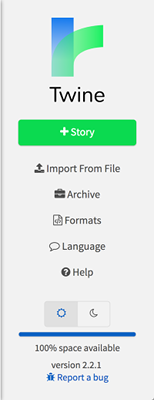
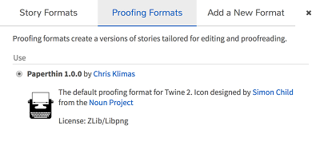
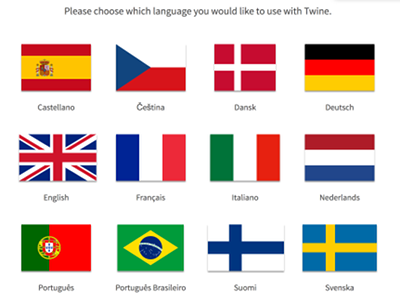

# Chapter 1: Using the Editor: Story Listing

### Story Listing

The very first screen upon opening Twine 2 in the desktop or online version is the story view or story listing. This shows all of the stories loaded in this version that can be opened and edited.

---

#### Side Menu

On the right-hand side is a menu for accessing different options in the editor.

---

##### +Story

Using the "+Story" allows the user to name and create a new story that will be added to the story listing.

---

##### Import From File

Using the "Import from File" functionality opens a dialog window to select a file and import it into the story listing. All files published with Twine 1 (starting with 1.4.2) are compatible and can be imported. However, major versions of the editor can only publish files matching its number.

---

##### Archive

Using the "Archive" button will produce a ZIP'd file containing all of the stories currently listed in the view.

---

##### Formats

"Formats" allows for adding to the current listing or changing the current default story format when creating new stories.

---

###### Story Formats

Opened by default, this tab shows all of the current story formats loaded in Twine 2. 

---

###### Proofing Formats

A listing of all of the current Proofing Formats loaded in Twine 2 as well as which one (if multiple are loaded) is the default for creating a "Proof Copy" of a story.

---

###### Add a New Format

Through pasting or typing out the URL of a new story format and using the "Add" button, other story formats can be loaded and used. Depending on if the loaded format was story or proof, it will appear as an option on those tabs once loaded and ready for use.

---

##### Language

Twine 2 supports over a dozen languages for named entries in its user interface. 

Selecting one of them will change the current language of the editor and its menus.

---

##### Help

Clicking on "Help" opens a new tab or window in the default browser on the ["Twine 2 Guide"](http://twinery.org/wiki/twine2:guide) of the wiki. 

---

##### Theme Options

Twine 2 comes with two themes: dark and light. Clicking on either icon switches the interface to that theme.

---

##### Current Storage (Online-version only)

When used online, the editor will keep track of how much local storage usage remains for creating and saving stories in Twine 2. Depending on the browser, system, and other settings, this amount can be different.

---

##### Version Information and Bug Reporting

At the bottom of the menu is the current version of Twine 2 and a link to the [Issues](https://github.com/klembot/twinejs/issues) page of the GitHub repository.

