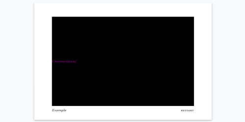

# Chapbook CSS

Stories in Chapbook can be styled in different ways through using its Vars Section.

Chapbook defines the global object `config.style` for changing these.

---

## Fonts and Colors

[Fonts and colors](https://klembot.github.io/chapbook/guide/customization/fonts-and-colors.html) can be adjusted in Chapbook through using the objects of **header**, **page**, and **footer** areas as part of the global `config.style`.

**Example:**

```twee
config.style.page.color: "red-6"
--

Passage content
```

> **Note:** Chapbook uses a specific syntax for writing colors using the [Open Colors](https://yeun.github.io/open-color/) system.

---

## Header and Footer

Passage content in Chapbook is also divided into seven areas arranged in the following arrangement.

| `config.header.left` | `config.header.center` | `config.header.right` |
|----------------------|------------------------|-----------------------|
|                      | main passage text      |                       |
| `config.footer.left` | `config.footer.center` | `config.footer.right` |

These correspond to elements with different classes (left, center, right) for both `<header>` and `<footer>`. Passage content is stored in an `<article>` element.

```html
<div id="page" aria-live="polite">
  <header>
    <div class="left"></div>
    <div class="center"></div>
    <div class="right"></div>
  </header>
  <article style="position: relative;">
    <div class="" style="">
      <p>Double-click this passage to edit it.</p>
    </div>
  </article>
    <footer class="has-content">
      <div class="left"></div>
      <div class="center"></div>
      <div class="right"></div>
     </footer>
</div>
```

---

## Overwriting Chapbook CSS

> **Note:** Overwriting existing CSS rules is an *advanced* technique and has the potential to significantly change the presentation of content.

All Chapbook stories follow the same [HTML structure](../../html/storyformats/chapbook.md#chapbook-html).

### Page > Article

All passage content is shown to users as part of an element with the *id* of `page` with an `<article>` element.

```html
<div id="page" aria-live="polite">
  <article style="position: relative;">
    <div class="" style="">
      <p>Double-click this passage to edit it.</p>
    </div>
  </article>
</div>
```

Targeting this selector allows for changing the presentation of passage content.

**Example CSS:**

```css
#page article {
  background-color: black;
  color: purple;
}
```

**Example Presentation:**



### Page > A

Passage links are represented as `<a>` elements in Chapbook.

Using the selector of `#page a` allows for changing the presentation of links in a story.

**Example CSS:**

```css
#page a {
  color: purple;
  border: 2px solid red;
}
```

**Example Presentation:**


