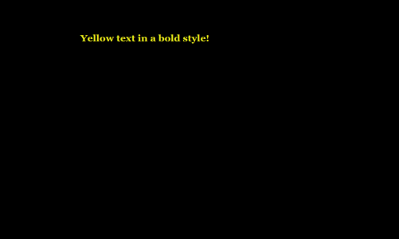

# Harlowe CSS

Harlowe strongly encourages authors to style stories through using [macros](https://twine2.neocities.org/#markup_macro) and named hooks.

---

## Named Hooks

### Page

`?Page`: Affects the `<tw-story>` element.

**Example:**

```twee
(enchant: ?Page, (text-color: yellow) + (text-style:'bold'))
Yellow text in a bold style!
```

**Example Presentation:**



### Passage

`?Passage`: Affects the `<tw-passage>` element), allowing `(text-colour:)`, `(font:)`, or `(css:)` usage with text content.

### Sidebar

`?Sidebar`: Affects the `<tw-sidebar>` element, allowing macros like `(replace:)` or `(append:)` to change text content

### Link

`?Link`: Affects all of the links (passage links and `(link:)`) in the passage.

---

## Overwriting Harlowe CSS

> **Note:** Overwriting existing CSS rules is an *advanced* technique and has the potential to significantly change the presentation of content.

All Harlowe stories follow the same [HTML structure](../../html/storyformats/harlowe.md#harlowe-html).

```css
tw-passage { /* Your CSS Here */ }
```
