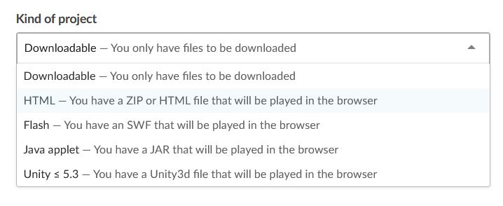
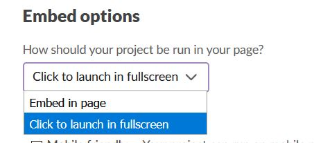
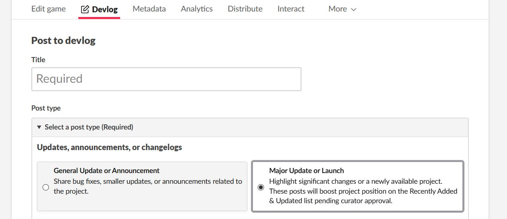

# Publishing Twine Games on Itch.io

[Itch.io](https://itch.io) is an online independent gaming marketplace that can be used to easily host Twine games for free. This guide will detail the process of uploading a Twine game to the site.

## Step 1: Create an Account

Create an account on Itch.io. You can also log in using an existing GitHub account, if you prefer. Once you have an account, you'll want to go to your profile settings and set up your account for uploading games:

In `Settings > Profile`, check the `Developing and uploading games` box. 

## Step 2: Create a New Project

Open the menu next to your user name and click `Upload new project`.

You'll now have a large form to fill out for your game. Most of the information should be self-explanatory, but there are a few things you'll want to be aware of for Twine games. First, set the `Kind of project` to `HTML`:

The next option you will probably want to change is the `Embed options`. Setting it to `Click to launch in fullscreen` is recommended for most Twine games.

This option is misnamed; the game will not open in fullscreen, but will instead open in the full browser window or tab instead of a small iframe. This is probably the best option for most Twine games.

Right next to this option are the `Frame options`. You'll want to check the `Enable scrollbars` box here; by default it is **not** checked:

Whether your game is mobile-friendly or not will be based on the format you are using, its version, and whether you've altered the default UI. If left unchecked, users on mobile phones or tablets will be warned that the game wasn't designed for their device, but will still be able to try to play the game.

The final thing you will probably want to set up is in the `Metadata` tab, in the `Engine & Tools` section:

Twine is selectable as an engine, and adding it here will help people in the Twine community find your game!

## Step 3: Uploading Project Files

The next step is to upload project files. If all you have is a single HTML file, you can just upload that file. If you have external files, like images or audio or other resources your game needs, you will need to create an archive (a zip folder) to upload instead.

If you create an archive, the HTML file for the Twine game should be in the root of the folder, and it needs to be called `index.html`. No other file name will work. For example, your folder may look like this:

You would then select the `index.html` file and its sibling files and folders and, on Windows, `Right click > Send to > Compressed (zipped) folder`. Note that you want to zip the files in the folder themselves, not the parent folder.

Whether you have a single HTML file or a zip archive, upload the file to your itch.io project page:

Once you've uploaded the file, check the box `This file will be played in the browser`:

Your game should now be playable on Itch.io!

## Bonus Step: Major Updates

If you bring a major update to the game, you can create a devlog entry with the `major update or launch` post type:

These devlogs are reviewed by the curators at Itch.io, and if your update is considered significant enough, the game's visibility will be significantly boosted for a while, similar to if it were brand new, helping you reach more people. People following you or your game will also be notified of the update.